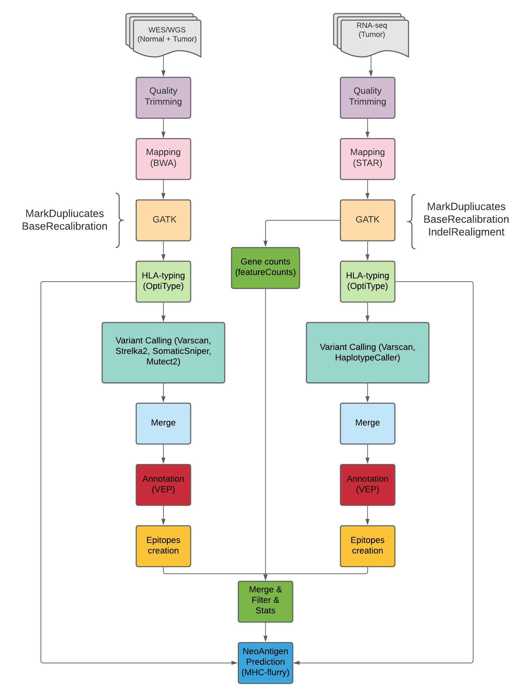

# DNA and RNA NGS variant calling toolset with HLA typing and Neoantigen predictions
This toolset can process DNA (tumor and normal) and RNA (tumor) dada in somatic mode
and generate a list of variants, HLAs and neoantigens with affinity scores. 

The DNA and RNA pipelines make use of the latest GATK4 best-practices.
All the tools and pipelines are fully parametrised and optimized for speed. 

There are 2 pipelines and 2 tools:

**dna_pipeline.py** processes DNA data and generates a list of unified
filtered and annotated somatic variants. 
The variant callers are Mutect2, Strelka, Varscan and SomaticSniper and both indels and SNPs are
reported. Annotation is performed using Annovar. 
The pipeline uses trim-galore to trim, bwa-men to align and follows GATK4 best practices. 
The pipeline also performs HLA predictions with HLA-LA (tumor and normal).

**rnapipeline.py** processes RNA data and generates a list of unified
annotated somatic variants (weak filtered) and also a list of gene counts values. 
The variant callers used are Varscan and HaplotypeCaller. Annotation is performed with Annovar.
The pipeline uses trim-galore to trim, STAR to align and follows GATK4 best practices. 
The pipeline also performs HLA predictions with arcasHLA.
The gene counts values are computed with featureCounts.

**merge_resuls.py** combines results from 1 or several runs of the DNA and RNA
pipelines in order to generate an unified table with useful information where
variants are filtered by certain criteria and epitopes are created for each of the variants
effects. 

**mhc_predict.py** can take the file generated with merge_results.py and the HLA files
generated in the DNA and/or RNA pipelines and then output a list of predicted neo-antigens.
Variants are filtered by certain criterias and only the most common alleles for each HLA class 1
are used. 

Each tool/pipeline uses a command line interface with parameters which
can be shown and described with --help.

See INSTALL.txt for installation instructions. 

See RUN.txt for running instructions.

## cDNA and Peptides dictionaries
merge_results.py requires two dictionaries, one mapping transcript ids to DNA sequences and another
one mapping transcript ids to peptide sequences. The format is the following for both files:

TRANSCRIPT_ID:SEQUENCE 

To build these dictionaries you can use as reference the Jupyter Notebooks located in dictionaries

## Output (important files)

**dna_pipeline.py** 
- annotated.hgXX_multianno.vcf (annotated and combined somatic variants)
- HLA predictions DNA (PRG-HLA-LA_Tumor_output.txt and PRG-HLA-LA_Normal_output.txt)

Other files:
  - combined_calls.vcf
  - tumor_dedup.bam
  - normal_dedup.bam

**rna_pipeline.py** 
- annotated.hgXX_multianno.vcf (annotated and combined germline variants)
- gene.counts
- HLA predictions (hla_genotype.json)

Other files:
  - combined_calls.vcf
  - sample_dedup.bam
  
**merge_results.py** 
- overlap_final.txt (all the somatic variants collapsed and filtered with useful information and epitopes)
- overlap_final_unique_rna.txt (all the unique RNA variants collapsed and filtered with useful information and epitopes)
- overlap_final_discarded.txt (all the discarded somatic variants collapsed with useful information and epitopes)
- overlap_final_discarded_rna (all the discarded RNA variants collapsed with useful information and epitopes)

**mhc_predict.py** 
- predictions_mut.csv (all the mutated peptides predictions)
- predictions_wt.csv (all the WT peptides predictions)

Other files:
  - protein_sequences_mu.fasta
  - protein_sequences_wt.fasta
  
## Contact
Contact: Jose Fernandez Navarro <jc.fernandez.navarro@gmail.com>

